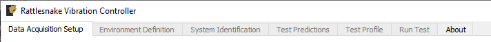
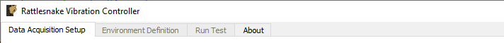
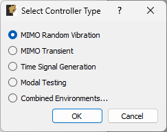
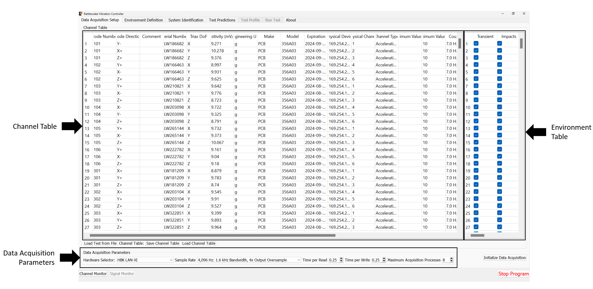
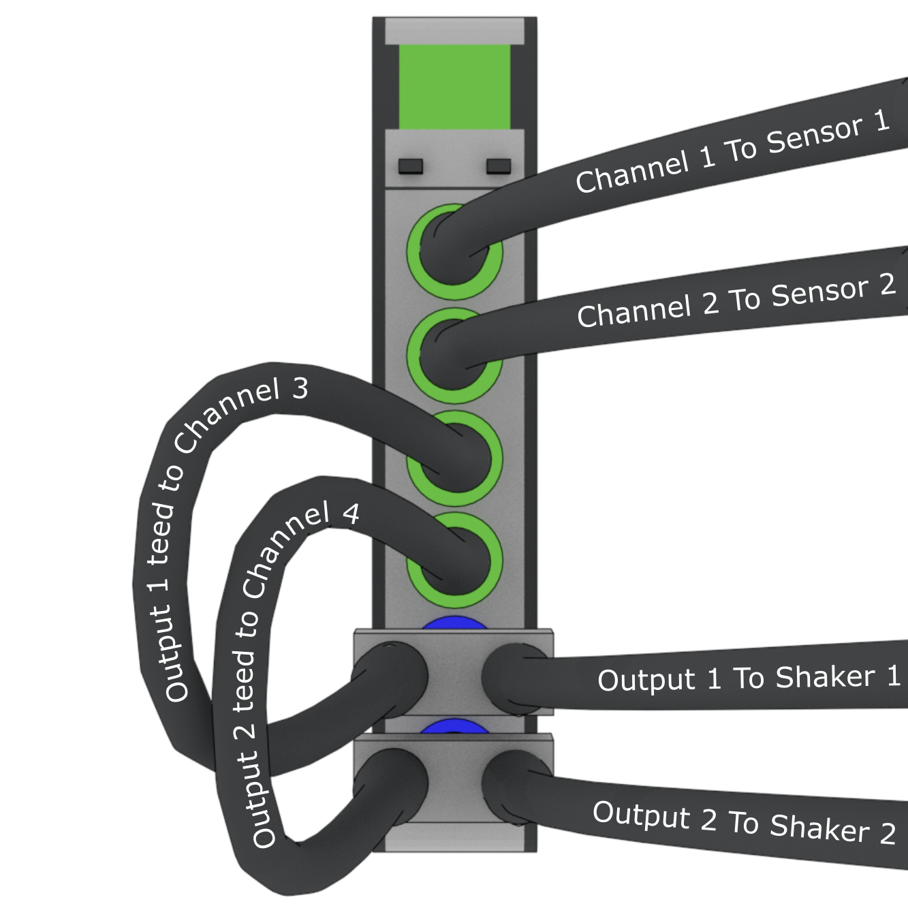
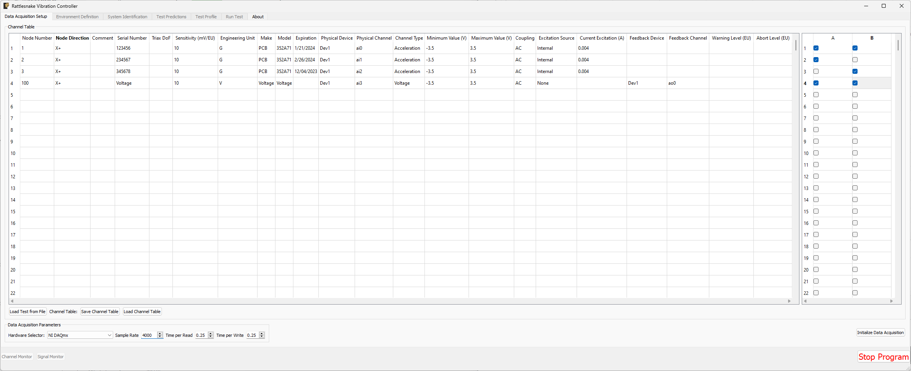
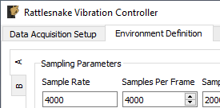
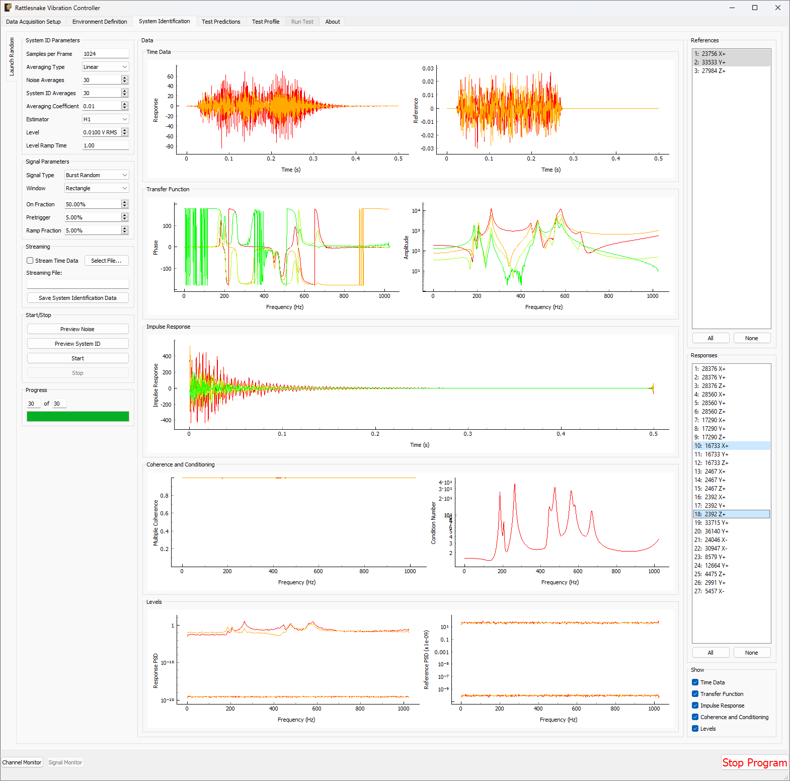
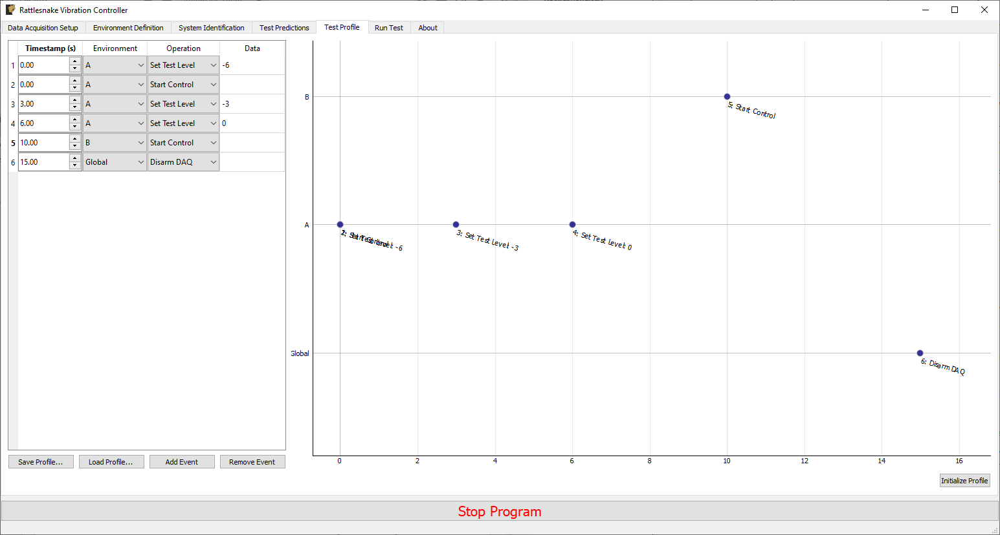
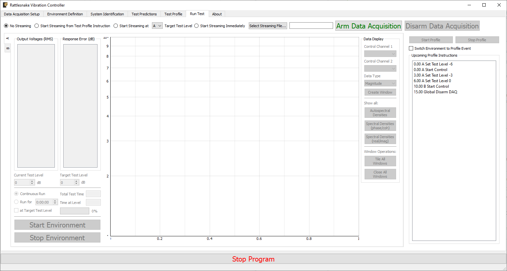

## 3. Using Rattlesnake

This chapter will describe how to use Rattlesnake through its graphical user interface (GUI).  Rattlesnake is capable of running several different types of control, therefore the GUI may look different for different tests.  In general, the GUI consists of a tabbed interface across the top of the main window, and users must complete each tab before proceeding to the next.  The tabs that exist in a given test will depend on which control type is being run.  For example, in a combined environments test (TODO: see Section \ref{sec:rattlesnake_environments_combining_environments}) such as the one shown in Figure 3-1, there is a `Test Profile` tab that allows the user to define a testing timeline.  Additionally, environments such as the MIMO Random Vibration environment (TODO: see Section \ref{sec:rattlesnake_environments_mimo_random}) require a system identification phase where the controller identifies relationships between the output signals and the control degrees of freedom.  Therefore, tests using the MIMO Random Vibration environment will also have a `System Identification` and `Test Predictions` tab.  Figure 3-2, on the other hand, shows the GUI for a test that only utilizes the Time History environment (TODO: see Section \ref{sec:rattlesnake_environments_time_generator}) so these optional tabs are not displayed.



**Figure 3-1. Rattlesnake GUI tabs when running a combined environments test with an environment that requires a system identification.**

Users of Rattlesnake must be aware that depending on their test configuration, their GUI may not appear identical to images shown in this User's Manual.  Additionally, users should be aware that the GUI library used by this software will inherit stylistic features from the operating system.  There may therefore be cosmetic differences between the images of the GUI shown in this document and the GUI seen by the user.  All images in this document were created using Microsoft Windows 10 or Windows 11 operating systems, so users with Mac or Linux operating systems will note a difference in GUI appearance.

Note that the Rattlesnake enforces an order to operations when defining a particular test by enabling and disabling tabs in the GUI.  Initially, only the first tab will be enabled.  As the users complete each tab, the next tab will become available.  In Figures 3-1 and 3-2, it can be seen that only the initial tab is enabled, and subsequent tabs are disabled.



**Figure 3-2. Rattlesnake GUI tabs when running a single environment with no system identification phase.**

### Environment Selection

When Rattlesnake is opened, the first GUI window that the user will see allows the user to select the environment that they will run (Figure 3-3.).  Users can select a single environment, or alternatively select a combined environments test (TODO: see Section \ref{sec:rattlesnake_environments_combining_environments}).  The selection made in this dialog box will determine which tabs are set up in the main GUI.



**Figure 3-3. Initial Rattlesnake dialog to select the type of control that will be run.**

### Global Data Acquisition Settings

The `Data Acquisition Setup` tab of the Rattlesnake GUI specifies the global test parameters that the controller will use.  Parameters are determined to be global when they affect all environments or the controller itself.  The three main sections of this portion of the interface are the Channel Table, Environment Table, and Global Data Acquisition Parameters.  Figure 3-4. shows this.



**Figure 3-4. Data Acqisition Setup tab in the Rattlesnake Controller where the Channel Table, Environment Table, and Data Acquisition Parameters are specified.**

#### Channel Table

The channel table specifies how the instrument channels in a given test are connected to the data acquisition hardware, as well as how the data read from those channels are used by the software.

In general, for a given test there will be a set of excitation devices that use the output signals from Rattlesnake as well as instrumentation to record the test article's responses to those exciters.  Rattlesnake requires each instrument (or each channel on each instrument for multi-axial instruments) as well as each excitation device to have a row in the channel table.  This is perhaps contrary to other control software where only the response channels need to be set up in the channel table.  However, to maintain the flexibility to run multiple types of hardware devices, some of which having limitations to their triggering capabilities, Rattlesnake must read in the signal from its output directly in order to be able to synchronize its outputs and the responses to those outputs.  Therefore, for all Rattlesnake test setups, the output signal should be split using a tee to the exciter and the corresponding input channel.  Because of this requirement, one should keep in mind that the number of acquisition channels required on the hardware device for a given test is actually the number of responses plus the number of outputs.  Figure 3-5 shows a schematic of a four acquisition channel, two output channel LAN-XI module set up for use with Rattlesnake.



**Figure 3-5. Output channels teed to acquisition channels so they can be read by the controller.**

The required data input into the channel table varies with the physical or virtual hardware used for the test.  For device-specific channel table requirements, see the appropriate section of [Part II](./chapter_04.md).  In general, the entries to the channel table are as follows:

* **Node Number** Determines the instrumentation position on the test article.  While not used directly by the controller except to label plots, it is important for book-keeping and test documentation.  The node number will generally correspond to a node in a test geometry or FEM.
* **Node Direction** Determines the instrumentation direction on the test article at the position specified by the Node Number.  Again, this is not used directly by the controller except to label plots, but it is important for book-keeping.  The Node Direction will generally correspond to the node's local coordinate system if one exists in the test geometry.
* **Comment** Provides space for additional information about a channel that may not be captured by the Node Number and Node Direction.
* **Serial Number** The serial number of the instrument used for the given channel.  This field is not used by the controller but will be stored with the test data and is important for data traceability to know which instruments were used to measure which channels.
* **Triax DoF** The degree of freedom on a given instrument corresponding to the given channel.  This is primarily used to distinguish between the three axes of a triaxial accelerometer, but has the potential to be used for other multi-axis instrumentation types such as strain gauge rosettes.
* **Sensitivity** The sensitivity of the instrument in millivolts per Engineering Unit.  This is used to transform the acquired data from a raw voltage to a engineering quantity such as acceleration or force.
* **Engineering Unit** The unit in which the measured signal for the given instrument will be reported.  Certain hardware will limit the units that can be specified: see [Part II](./chapter_04.md) for more information.
* **Make** The name of the instrument's manufacturer, used for data traceability.
* **Model** The product name or model number of the instrument, used for data traceability.
* **Expiration** The expiration date of the instrument's calibration certificate.  Note that this is only for data traceability; no checking of this date with the current data to ensure a valid calibration is performed by the software.
* **Physical Device** The reference to a physical device attached to the computer.  The entries in this field will be specific to the acquisition hardware being used for a given test.  For virtual control, this column must be filled to specify that a given channel is active.  See [Part II](./chapter_04.md) for more information.
* **Physical Channel** The reference to a channel on a physical device attached to the computer.  The entries in this column will be specific to the acquisition hardware being used for a given test.  See [Part II](./chapter_04.md) for more information.
* **Channel Type** The type of the channel being used for a given test, such as Acceleration, Force, or Voltage.  The allowable entries in this column will be specific to the acquisition hardware being used for a given test.  See [Part II](./chapter_04.md) for more information.
* **Minimum Value (V)** The minimum voltage that the data acquisition system can handle during a test.  This is used to set the range on the data acquisition system.  For hardware devices with symmetric ranges (e.g. $\pm$10V), this column can be left blank.
* **Maximum Value (V)]**  The maximum voltage that the data acquisition system can handle during a test.  This is used to set the range on the data acquisition system.  For hardware devices with symmetric ranges (e.g. $\pm$10V), this column is used to set the maximum and minimum voltage values.
* **Coupling** The coupling used by the data acquisition system.  This may include filtering in addition to AC/DC coupling, which is dependent on the hardware being used for a given test.  See [Part II](./chapter_04.md) for more information.
* **Excitation Source** Used to specify the signal conditioning that is required by the instrument.  This column is generally where the constant current line drive (CCLD)/integrated electronics piezoelectric (IEPE)/integrated circuit piezoelectric (ICP) is specified for a given hardware device.  See [Part II](./chapter_04.md) for more information.
* **Current Excitation (A)** Used to specify the excitation current sent to the device for signal conditioning.  Depending on whether the device has a fixed or variable excitation current, this field may be left empty.  This can also be left empty if no signal conditioning is provided by the data acquisition system.  See [Part II](./chapter_04.md) for more information.
* **Feedback Device** For output channels, this is the reference to the output or excitation device that is being fed back into the current channel's Physical device.  If the current channel is not an output channel, it should be left empty.  A populated Feedback Device column tells the controller that the given channel is an output channel.
* **Feedback Channel** For output channels, this is the reference to the output channel on the output or excitation device that is being fed back into the current channel's Physical Device.  As an example using generic device and channel names, if `Channel 2` on `Generator 1` is teed off to `Channel 3` on `Acquisition Card 2`, the corresponding row in the channel table would have `Acquisition Card 2` specified as the Physical Device, `Channel 3` specified as the Physical Channel, `Generator 1` specified as the `Feedback Device` and `Channel 2` specified as the feedback channel.
* **Warning Level** A warning level can be implemented for each channel.  The warning level is specified in the same units as the Engineering Unit column.  When a channel hits the warning limit, it will be flagged as Yellow in the Channel Monitor (TODO: see Section \ref{sec:channel_monitor}).  The warning level can be left blank if no warning is desired.
* **Abort Level** An abort level can be implemented for each channel.  The abort level is specified in the same units as the Engineering Unit column.  When a channel hits the abort limit, it will be flagged as Red in the Channel Monitor (TODO: see Section \ref{sec:channel_monitor}).  The controller will also shut down if an abort level is reached.  The abort level can be left blank if no abort is desired.

To limit the tediousness of inputting channel table information into the GUI by hand, the channel table can be loaded from an Excel spreadsheet or Comma-separated-value file.  A channel table can be loaded by clicking the `Load Channel Table` button under the channel table, which will bring up a file selection dialog, enabling the user to select a file to load.  For convenience, a template Excel spreadsheet is attached to this PDF: (TODO) \attachfile{attachments/channel_table_template.xlsx}.  A template Excel file can also be generated by creating a test in Rattlesnake and saving the empty channel table by clicking the `Save Channel Table` button under the channel table.  If a channel table is filled out in Rattlesnake's GUI, its contents will be saved to the file as well.

A complete test can be loaded by clicking the `Load Test from File` button.  See Section (TODO) \ref{sec:load_rattlesnake_test} for more details.

#### Environment Table

For combined environments tests, an environment table is also provided to the right of the standard Channel Table.  This table specifies which channels are used by which environments.  A channel can be used for multiple environments, a single environment, or no environments.  Channels used by no environments will still be measured and streamed to disk, but will not be sent to any environment for use in the respective control approaches.  The environment table is also used to specify which excitation devices are used by which environment.

For single environment tests, the environment table is not visible, and the software assumes that all channels in the channel table are used by the single environment.

If importing a channel table from an Excel spreadsheet for a combined environments test, the Environment Table can be specified as the columns after the main Channel Table information (starting in Column X with one column for each environment) with the environment name specified in row 2 and an entry (e.g. an `X` or some other mark) in the row corresponding to a given channel if that channel is used for the given environment.

#### Data Acquisition Parameters

The final portion of `Data Acquisition Setup` tab specifies data acquisition parameters.  These parameters may change depending on the hardware selected.

* **Hardware Selector** The physical or virtual hardware used for the test.  See [Part II](./chapter_04.md) for hardware specific details of the controller.  For some devices, a file selector window will appear will appear when the device is selected, as that device needs more information to operate.  This is primarily the case for virtual hardware where some model of the test article must be loaded.  This is also used when a specific hardware device needs to access external functionality in a library such as a `dll` file.
* **Sample Rate** The sample rate of all hardware devices used for the test.  Some devices will have arbitrary sample rates, and some devices have fixed sample rates, so the options available will depend on the acquisition hardware being used.
* **Time per Read** The amount of data that the acquisition system will acquire with each read from the hardware.  By reading data in chunks, hardware input/output operations with relatively large overhead can be limited, and the buffer gives the controller time to catch up if e.g. the operating system decides to start a computationally intensive task in the background of the computer.  Note that specifying large numbers for this quantity (e.g. 10) will reduce the responsiveness of the controller, because the controller will potentially not receive the acquired data until 10 seconds after it was acquired.  Note also that this does not need to correspond to the Samples per Analysis Frame or any other signal processing parameter used by an environment.  Each environment should be buffered such that it creates appropriately sized analysis windows from the differently sized acquisition chunks.
* **Time per Write** The amount of data that the output system will write with each write to the hardware.  By writing data in chunks, hardware input/output operations with relatively large overhead can be limited, and the buffer gives the control time to catch up if e.g. the operating system decides to start a computationally intensive task in the background of the computer.   Note that this output is also buffered, so it does not need to be equal to the size of the data that will be created during each control loop of the controller.
* **Maximum Acquisition Processes** For specific hardware devices with large channel count tests, it can be difficult to pull down large quantities of data fast enough for the controller to keep up using a single process.  This option allows the user to specify how many processes can be given to the acquisition system to be used to stream data off the hardware.  Note that too many processes will bog down the computer, and too few will result in the controller falling behind.  Generally about 20-40 channels per processor is sufficient, but this will depend on the sample rate.  For higher sample rates, more processors may be needed.
* **Integration Oversample** For synthetic hardware devices that integrate equations of motion, an integration oversample factor can be specified.  This factor will be applied to the sample rate to determine the time step for the integration.  Generally a factor of 10 is sufficient for reasonably accurate data without significant computational expense.

#### Initialize Data Acquisition

With the Data Acquisition Settings specified in the GUI, the Data Acquisition can be initialized by pressing the `Initialize Data Acquisition` button.  At this point, the controller will go through and create the programming interfaces to the hardware device, specify the sampling parameters, and create the channels on the devices.  The software will then proceed to the next tab.

Figure 3-6 shows a completed `Data Acquisition Setup` tab with three response channels and one output channel for a test with two environments `A` and `B`.  The first response and output channels are used by both environments, while the second response channel is used only by environment `A` and the third response channel is used only by environment `B`.



**Figure 3-6.  Example of a completed `Data Acquisition Setup` tab with three response channels and one output channel.**

### Environment Definition

The `Environment Definition` tab is the second tab in the Rattlesnake software.  It is in this tab that the various environments are defined.  The main tab will have one sub-tab for each environment, as shown in Figure 3-7.



**Figure 3-7. Sub-tabs for environments `A` and `B` in the `Environment Definition` tab.**

Different environment types will have different parameters that can be set.  See [Part III](./chapter_12.md) for a description of each environment type in Rattlesnake and the parameters that define it.

When all environments are defined, the `Initialize Environments` button can be pressed to proceed to the next portion of the controller.

### System Identification

With the environments defined, the controller proceeds to the `System Identification` tab if required by any environment, shown in Figure 3-8.  During this phase of the controller, the controller will develop relationships between the excitation signals and the responses of the test article to those excitation signals.  It will also make a measurement of the noise floor of the test.



**Figure 3-8. System identification tab showing various signals and spectral quantities that can be used to evaluate the test.**

Not all environment types will require a system identification.  For environments that simply stream output data, a system identification will generally not be required.  However for any environment that aims to produce an output that creates some response on the test article, a system identification will be required to understand the relationships between the excitation signals and the response signals.

There will be one sub-tab for each environment that requires a System Identification.  System identification must be run for each sub-tab before the test can be run.  When system identification is performed, the software will first perform a noise floor measurement, where all channels are recorded, but no excitation signal is provided.  After the noise floor calculation completes, the system identification will begin.

The `System Identification` tab has been significantly overhauled since the previous version of controller.  The system identification now has a number of dedicated parameters on its tab that the user can select.  These are:

* **Samples per Frame** The number of samples used in each measurement frame.
* **Averaging Type** The type of averaging used to compute the spectral quantities.  Linear averaging weights each measurement frame equally.  Exponential averaging weights more recent frames more heavily.
* **Noise Averages** The number of averages used in the noise characterization.
* **System ID Averages** The number of averages used in the System Identification characterization.
* **Averaging Coefficient** If Exponential Averaging is used, this is the weighting of the most recent frame compared to the weighting of the previous frames.  If the averaging coefficient is $\alpha$, then the most recent frame will be weighted $\alpha$, the frame before that will be weighted $\alpha(1-\alpha)$, the frame before that will be $\alpha(1-\alpha)^2$, etc.
* **Estimator** The estimator used to compute transfer functions between voltage signals and responses.
* **Level** The RMS voltage level used for the system identification
* **Level Ramp Time** The startup and shutdown time of the system identification.

The new system identification tab also gives the option to select the signal to use for system identification.

* **Signal Type** The type of signal that will be used for System Identification.  This can be Random, Burst Random, Chirp, or Pseudorandom.  Random is the most flexible, but requires a Hann window which can distort data.  Burst Random does not require a window, but the response signal must decay within the measurement frame.  Chirp and Pseudorandom do not require windows, and do not need to decay, but they are only useful for environments with a single excitation device.
* **Window** The window function used for the system identification signal
* **Overlap** The overlap percentage between measurement frames used in System Identification
* **On Fraction** The fraction of the frame that the Burst Random signal is active for
* **Pretrigger** The fraction of the frame before the Burst Random signal starts
* **Ramp Fraction** The fraction of the Burst Random On Fraction that is used to ramp up and ramp down.

The system identification phase can stream time data to disk by selecting a streaming file and clicking the `Stream Time Data` checkbox.  If streaming time data, the noise measurement will be saved to the variable name `time_data` and the system identification measurement will be saved to the variable name `time_data_1` (TODO: see Section \ref{sec:using_rattlesnake_output_files} for more information on the structure of this file).  The spectral data from the system identification can be saved to disk by clicking the `Save System Identification Data` button and selecting the file.

To run the system identification, there are buttons to Preview the Noise or System ID characterizations.  When ready, the `Start` button can be clicked.  It will run a Noise Characterization for the specified number of `Noise Averages`, and then subsequently run the System Identification characterization for the specified number of `System ID Averages`.  If the user wishes to run either the noise or system identification phases continuously, they can click the `Preview Noise` or `Preview System ID` buttons.

Data will be plotted as the system identification proceeds.  The signals to visualize can be selected by clicking one or more of the `References` or `Responses` channels on the right side of the screen.  In the bottom right corner, there are options to show or hide various quantities of interest.  The `System Identification` tab can show the following:

* **Time Data** Raw Time Data as it is streamed from the data acquisition system.  Only data used in spectral computations is shown, so the users shouldn't see any data that is ramping up or down as if the controller is starting or stopping.
* **Transfer Function** These are the transfer functions between the References (e.g. voltage signals) and the Responses (e.g. Accelerations or Forces).  The controller will use these transfer functions to develop excitation signals that will be played to the shaker to achieve a desired response.
* **Impulse Response**  The impulse response of the system can be visualized.  This can be helpful to debug issues with transient control.
* **Coherence and Conditioning** Coherence will be displayed so the user can judge how satisfactory the input/output relationships that are developed are.  If coherence is poor, it could suggest that the controller won't be able to control the structure properly.  The condition number of the Transfer Function Matrix is also displayed.  This can be useful to determine what level of regularization a control law might need to implement.
* **Levels** The autopower spectral density of each signal will be displayed both for the system identification as well as for the noise characterization.  This can help identify if the system identification is high enough out of the noise floor.

### Test Predictions

Once the system identification phase completes, the controller will compute a test prediction for each environment where system identification was completed.  This prediction will be based on the measured transfer functions between output signals and measured responses, as well as the environment parameters specified on the `Environment Definition` tab.  Predictions will be made both for outputs required as well as response accuracy.  These predictions will be displayed on the `Test Predictions` tab.

### Test Profiles

The `Test Profile` tab gives the user the ability to set up a test timeline for complex combined environments tests.  The user can add a list of events that will be executed at certain times during the test.  The tab will also display a graphical representation of the test timeline.

Events can be added or removed from the test timeline by clicking the `Add Event` or `Remove Event` buttons.  Users can also load a series of events from an Excel spreadsheet.

For each event, the following parameters are defined:

* **Timestamp (s)** The time in seconds after the timeline has started that the event will be executed.
* **Environment** The environment in which the event will occur.
* **Operation** The operation that will occur to the event.  Each environment defines its own set of operations that can be executed through the test profile interface.
* **Data** Any additional data that the operation requires.  For example, if a ``Set Test Level'' event is chosen, the Data field should specify the value that the test level is set to.

Figure 3-9 shows an example of a test profile that ramps up the test level of environment `A` from -6 to 0 dB, and then subsequently starts environment `B`.



**Figure 3-9. Example test profile showing a ramp up of test level for environment `A` and subsequently starting environment `B`.

### Run Test

The `Run Test` tab is where Rattlesnake finally runs the test.  This tab again has sub-tabs for the different environments in the test, however these sub-tabs will not be enabled until the data acquisition system is armed.

Rattlesnake gives the user many options to save data to the disk through a set of Radio buttons at the top of this tab.  These options are:

* **No Streaming** Do not save data to disk, just run the test.
* **Start Streaming from Test Profile Instruction** Selecting this option allows data to be saved to disk after a "Global Start Streaming" event from the test profile is executed.  This allows the user to fine tune at which point in the test data is acquired.
* **Start Streaming at <environment> Target Test Level** Selecting this option starts streaming data when the selected environment hits its target test level.  This can be useful if, for example in a random environment, the user wishes to start at a low level and slowly creep up to the target test level.  If all data is saved, it might require a large amount of file space, so instead only the data at the test level of interest can be saved.
* **Start Streaming Immediately** Saves all data from the time the first environment starts until the data acquisition system is disarmed.
* **Manually Start/Stop Streaming** Allows the user to start and stop the measurement periodically throughout the test.  A `Start Streaming` button will appear when this option is selected.  When clicked, the button will change to `Stop Streaming`.  Multiple data streams can be saved in a given test.  These will be stored to separate variables in the output NetCDF4 file (TODO: see Section \ref{sec:using_rattlesnake_output_files}).

When streaming data, it is important to note that the software does not stop streaming until the data acquisition system is disarmed by pressing the `Disarm Data Acquisition` button.  This is because for a combined-environments test, the environments may have down-time between them where no environment is running, and that data should still be saved.

The `Run Test` tab contains global `Arm Data Acquisition` and `Disarm Data Acquisition` buttons that start and stop the data acquisition system.  When the data acquisition system is armed, the user can no longer change streaming options, and the sub-tabs for each environment are enabled.  The user can then start or stop each environment manually using the `Start Environment` or `Stop Environment` buttons on each environment's sub-tab.  The sub-tab for each environment is described more thoroughly in [Part III](./chapter_12.md).

Alternatively, the user can start or stop the test profile by clicking on the `Start Profile` or `Stop Profile` buttons respectively.  The profile capability also includes the option to switch the active environment sub-tab when an event is executed so the user can see the results.  Note that the profile options only appear when a profile has been defined on the `Test Profile` tab.

Figure 3-10 shows an example `Run Test` tab with test profile events.



**Figure 3-10. Run Test Tab.**

### Rattlesnake Output Files <!--Section 3.8-->

After data is acquired, the user may wish to analyze or plot the data acquired for a given test report.  Rattlesnake stores data in a self-documenting netCDF file {{#cite unidata2019_netcdf}}, which can be read by multiple platforms.  The output file is described as self-documenting because it contains all parameters necessary to reconstruct a given test using the Rattlesnake controller.  Any parameter that is set by the user in the GUI is stored to the netCDF file.

A full description of the netCDF file format is out of this document's scope, but the important points are briefly described here.  NetCDF files have a number of data structures.  Variables are multi-dimensional arrays of data.  Dimensions describe the axes of the variable arrays.  Attributes are used to store small data such as scalars or 1D arrays.  NetCDF files can be separated into different groups, and each group can have its own variables, dimensions, and attributes.

The Rattlesnake output files contain the following data members:

#### NetCDF Dimensions <!--Subsection 3.8.1-->

* **`response_channels`** The number of response channels in a given test
* **`output_channels`** The number of output channels in a given test
* **`time_samples`** The number of time samples measured in the file, this dimension can expand as more data is acquired.
* **`time_samples_X`** If manual streaming is used and streaming is started multiple times, each subsequent stream will have the `time_samples` name with an underscore and appended number (e.g. `time_samples_1`, `time_samples_2`)
* **`num_environments`** The total number of environments in the test

#### NetCDF Attributes <!--Subsection 3.8.2-->

* **`sample_rate`** The global sample rate of the data acquisition system
* **`time_per_write`** The amount of data put to the output hardware per write operation, in seconds
* **`time_to_read`** The amount of data read from the acquisition hardware per read operation, in seconds
* **`hardware`** The hardware index used for the test.
  * 0 -- National Instruments NI-DAQmx
  * 1 -- HBK LAN-XI Open API
  * 2 -- Data Physics Quattro
  * 3 -- Data Physics 900 Series
  * 4 -- Virtual Control defined by Exodus Modal Solution
  * 5 -- Virtual Control defined by State Space Matrices
  * 6 -- Virtual Control defined with a SDynPy System
* **`hardware_file`** The path to the file used to define the Virtual test article, or the path to the external code library used by the data acquisition hardware.  Otherwise, it will be `None`
* **`maximum_acquisition_processes`** The maximum number of processes that the LAN-XI hardware can use for acquisition
* **`output_oversample`** The oversample used either due to sample rate restrictions on the data acquisition system, or due to oversampling the integration

#### NetCDF Variables <!--Subsection 3.8.3-->

* **`time_data`** The measured data from the test. Type: 64-bit float; Dimensions: `response_channels` $\times$ `time_samples`
* **`time_data_X`** If manual streaming is used and streaming is started multiple times, each subsequent stream will have the `time_data` name with an underscore and appended number (e.g. `time_data_1`, `time_data_2`)
* **`environment_names`** The name of each environment. Type: string; Dimensions: `num_environments`
* **`environment_active_channels`** The channels active in each environment.  1 if active, 0 if not. Type: 8-bit int; Dimensions: `response_channels` $\times$ `num_environments`

#### Channels Group <!--Subsection 3.8.4-->

The netCDF files from Rattlesnake store all channel information into a separate group called `channels`.  Inside the `channels` group, there is a variable for each column of the channel table.  See Section [Channel Table](#channel-table) for more complete descriptions of each channel variable.

* **`/channels/node_number`** The node number of each channel.  Type: str; Dimensions: `response_channels`
* **`/channels/node_direction`** The instrument direction of each channel.  Type: str; Dimensions: `response_channels`
* **`/channels/comment`** The commend for each channel.  Type: str; Dimensions: `response_channels`
* **`/channels/serial_number`** The serial number of the instrument for each channel.  Type: str; Dimensions: `response_channels`
* **`/channels/triax_dof`** The sensor degree of freedom for each channel.  Type: str; Dimensions: `response_channels`
* **`/channels/sensitivity`** The sensitivity of the instrument for each channel.  Type: str; Dimensions: `response_channels`
* **`/channels/unit`** The engineering unit of the instrument for each channel. Type: str; Dimensions: `response_channels`
* **`/channels/make`** The manufacturer of the instrument for each channel.  Type: str; Dimensions: `response_channels`
* **`/channels/model`** The model number or product name of the instrument for each channel.  Type: str; Dimensions: `response_channels`
* **`/channels/expiration`** The expiration date of the instrument's calibration for each channel.  Type: str; Dimensions: `response_channels`
* **`/channels/physical_device`** The physical device that the instrument is connected to for each channel.  Type: str; Dimensions: `response_channels`
* **`/channels/physical_channel`** The channel in the physical device that the instrument is attached to for each channel.  Type: str; Dimensions: `response_channels`
* **`/channels/channel_type`** The type of quantity that is measured by the channel.  Type: str; Dimensions: `response_channels`
* **`/channels/minimum_value`** The minimum voltage that the channel can accept.  Type: str; Dimensions: `response_channels`
* **`/channels/maximum_value`** The maximum voltage that the channel can accept.  Type: str; Dimensions: `response_channels`
* **`/channels/coupling`** The coupling type used by each channel (AC/DC/filter/etc.).  Type: str; Dimensions: `response_channels`
* **`/channels/excitation_source`** The excitation source for each channel, used to specify CCLD/ICP/IEPE.  Type: str; Dimensions: `response_channels`
* **`/channels/excitation`** The excitation current value used in the signal conditioning for each channel.  Type: str; Dimensions: `response_channels`
* **`/channels/feedback_device`** The device that the channel's generator originates from if the channel is an output channel.  Type: str; Dimensions: `response_channels`
* **`/channels/feedback_channel`** The channel that the channel's generator originates from if the channel is an output channel.  Type: str; Dimensions: `response_channels`
* **`/channels/warning_level`** The warning level of each channel.  Type: str; Dimensions: `response_channels`
* **`/channels/abort_level`** The abort level of each channel.  Type: str; Dimensions: `response_channels`

#### Environment Groups <!--Subsection 3.8.5-->

Environment-specific attributes, dimensions, and variables are also stored within a group corresponding to each environment.  For example, in the case where there were two environments "A" and "B", parameters specific to environment "A" would be stored within the group "A" in the netCDF file, and similarly for "B".  See [Part III. Rattlesnake Environments](./chapter_12.md) for more information on environment-specific parameters.

To read data from a netCDF using Python, it is recommended to use the `netCDF4` Python package.  This library is a dependency of Rattlesnake, so if the user is not running Rattlesnake via an executable, this package should already be installed in the user's Python ecosystem.

netCDF4 provides a sleek Python interface into the data of a netCDF4 file.  This section will assume the command `import netCDF4 as nc4` was used to import the package, so `nc4` is used as a shorter alias.

A netCDF4 dataset can be opened using the following command:

```python
dataset = nc4.Dataset('path/to/netcdf4/file.nc4')
```

after which all data can be accessed through the `dataset` object.
    
Attribute names can be queried using the `dataset.ncattrs()` function and the attribute values can be accessed directly from the `dataset` object using that name.

```python
>>> dataset.ncattrs()
['sample_rate',
'samples_per_write',
'samples_per_read',
'hardware',
'hardware_file']

>>> dataset.sample_rate
2048
```

Dimensions can be accessed using the `dataset.dimensions` property, which gives a Python `dict` where the keys are the dimension names and the values are references to the dimension.  The size of the dimension can be accessed using the `size` parameter in each dimension object.

```python
>>> dataset.dimensions
{'response_channels': <class 'netCDF4._netCDF4.Dimension'>: name = 'response_channels', size = 30,
'output_channels': <class 'netCDF4._netCDF4.Dimension'>: name = 'output_channels', size = 3,
'time_samples': <class 'netCDF4._netCDF4.Dimension'> (unlimited): name = 'time_samples', size = 31745,
'num_environments': <class 'netCDF4._netCDF4.Dimension'>: name = 'num_environments', size = 2}

>>> dataset.dimensions['response_channels'].size
30
```

Variables can be accessed similarly to dimensions using the `dataset.variables` property.  Variables have many properties that may be interesting to the users, including the netCDF dimensions that were used to size the variable (accessible with the `dimensions` parameter) or the actual shape of the array (accessible with the `shape` parameter).  The data inside the dimension can be accessed by slicing or indexing the array, or simply passing it to a `numpy` array.  Note that slicing or indexing the variable returns the data in a `numpy` masked array which allows data to potentially to be missing from the array.  Rattlesnake does not use the missing data capabilities of the netCDF file, so data can safely be transformed directly to a regular `numpy` array.

```python
>>> dataset.variables
{'time_data': <class 'netCDF4._netCDF4.Variable'>
float64 time_data(response_channels, time_samples)
unlimited dimensions: time_samples
current shape = (30, 31745)
filling on, default _FillValue of 9.969209968386869e+36 used,
'environment_names': <class 'netCDF4._netCDF4.Variable'>
vlen environment_names(num_environments)
vlen data type: <class 'str'>
unlimited dimensions: 
current shape = (2,),
'environment_active_channels': <class 'netCDF4._netCDF4.Variable'>
int8 environment_active_channels(response_channels, num_environments)
unlimited dimensions: 
current shape = (30, 2)
filling on, default _FillValue of -127 ignored}

# Get the dimensions used by the variable
>>> dataset.variables['time_data'].dimensions
('response_channels', 'time_samples')

# Get the shape of the variable
>>> dataset.variables['time_data'].shape
(30, 31745)

# Access via slice returns a masked array
>>> dataset.variables['time_data'][0,0]
masked_array(data=-0.00312098,
mask=False,
fill_value=1e+20)

# Can pass directly to a numpy array to get the full variable data
>>> np.array(dataset.variables['time_data'])
array([[-3.12098493e-03,  4.26820006e-03,  3.77395182e-03, ...,
         2.00690958e-01,  3.38505511e-01,  0.00000000e+00],
        [-6.10438702e-03,  1.50628999e-02, -1.50619535e-02, ...,
         2.67639515e-01,  5.50047023e-01,  0.00000000e+00],
        [-3.42732089e-03,  7.76593927e-03, -2.66239267e-03, ...,
         2.05434816e-01,  3.21815820e-01,  0.00000000e+00],
         ...,
        [ 3.71743658e-06, -8.77497995e-08, -8.80558595e-06, ...,
         -5.26559214e-06,  0.00000000e+00,  0.00000000e+00],
        [-1.32020650e-05,  2.74453772e-05, -2.01551409e-05, ...,
         -1.02501347e-05,  0.00000000e+00,  0.00000000e+00],
        [-5.96816619e-07, -1.47868461e-05, -5.24157875e-05, ...,
         -1.61722666e-05,  0.00000000e+00,  0.00000000e+00]])
```

Group names in the netCDF dataset can be queried using `dataset.groups`, which returns a dictionary similar to the dimensions and variables.  Groups can also be accessed by indexing the dataset directly with the group name.  A group object can be treated exactly the same as the root-level dataset, and will have its own set of attributes, dimensions, and variables.

```python
>>> dataset['channels'].variables['node_number']
<class 'netCDF4._netCDF4.Variable'>
vlen control(response_channels)
vlen data type: <class 'str'>
path = /channels
unlimited dimensions: 
current shape = (30,)
```

<!-- Next: 3.8.7 Reading from MATLAB -->
