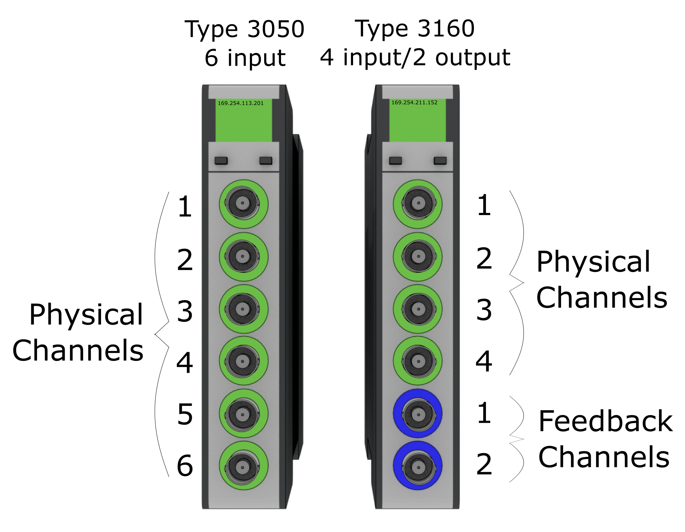
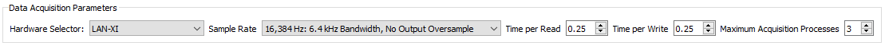

# 5. LAN-XI Devices

(sec:lanxi_hardware)=
# LAN-XI Devices

Rattlesnake is able to run HBK LAN-XI devices using the hardware's [OpenAPI](https://www.bksv.com/en/instruments/daq-data-acquisition/lan-xi-daq-system/open-api).  Rattlesnake communicates with the LAN-XI hardware via Ethernet, so for best results, the computer's Ethernet card should be connected with the LAN-XI hardware rather than using a USB Ethernet dongle, which in the author's experience can lead to lower network speeds and more time required to pull data off the hardware.

### Setting up the Channel Table for LAN-XI Devices <!--Section 5.1-->

This section describes the process to set a channel table in Rattlesnake for the LAN-XI hardware.
    
LAN-XI devices are defined by an IP address, which is displayed on each module when it is plugged into a computer or a LAN-XI frame.  This IP address should be specified as the `Physical Device` or `Feedback Device` in the channel table for a acquisition or output channel, respectively.  The `Physical Channel` or `Feedback Channel` range from 1 to the number of channels on the module.  Figure 5-1 shows an example case for setting up a LAN-XI test.
    

**Figure 5-1. Physical Channel and Feedback Channels for LAN-XI modules.  The left device would have the Physical Device 169.254.113.201 and Physical Channels 1, 2, 3, 4, 5, and 6.  The right device would have Physical Device 169.254.211.152 and Physical Channels 1, 2, 3, and 4.  The right device would also have Feedback Device 169.254.211.152 and Feedback Channels 1 and 2**
    
The `Maximum Value` column in the channel table is used to set the range on the LAN-XI hardware.  The only two valid options for LAN-XI hardware ranges are `10` and `31.6`.  No other range is allowable.  The Minimum Value column is not used and can be left blank.
    
The Coupling column in the channel table is used to specify the filter used in the LAN-XI hardware.  Valid values for coupling are `DC`, `0.7 Hz`, `7.0 Hz`, `22.4 Hz`, or `Intensity`.
    
Current Excitation Source is used to specify if a channel uses CCLD or not.  If CCLD is to be used on a given channel the Current Excitation Source column should contain `CCLD`.  If CCLD is not to be used for that channel, the column can be left blank.

### Hardware Parametters <!--Section 5.2-->

LAN-XI hardware devices have discrete sample rates, which are powers of 2 staring with 4096 samples per second.  The minimum sample rate of the generator is 16,384 Hz, so the output must be over-sampled if the acquisition sample rate is less than 16,384 samples per second.  Environments defined in Rattlesnake must be able to handle output oversampling when required by the hardware device.
    
For large channel count tests, Rattlesnake struggles to pull data off the acquisition device fast enough using just one process.  Therefore, a maximum number of acquisition processes can be specified.  If too few processes are used, it will take longer to read data off the hardware than it took to acquire the data.  This will result in the controller falling behind and the data buffer on the hardware slowly filling.  Alternatively if too many processes are used, the computer running Rattlesnake will get bogged down swapping between processes, and other parts of the controller (particularly the GUI) may become slow.  Generally, 20-40 channels per process is a reasonable rule of thumb, though this will depend on the Sample Rate of the hardware.
    

**Figure 5-2. LAN-XI data acquisition parameters.**

### Implementation Details <!--Section 5.3-->

This section contains details on the LAN-XI implementation in Rattlesnake, which may be helpful for users when diagnosing issues that arise in the controller.

#### ReST API <!--Subsection 5.3.1-->

Rattlesnake communicates with the LAN-XI using a ReST interface.  Rattlesnake sends and receives JSON packages that define state transitions in the hardware using HTTP commands.

#### Setting up the LAN-XI <!--Subsection 5.3.2-->

The LAN-XI hardware is set up primarily by the Output process of the controller.  The LAN-XI hardware can be used in either single or multi-module mode.  It will generally take a while to set up the LAN-XI configuration.  Lights will flash on the LAN-XI hardware while the setup is occurring, and information will be printed to the command terminal that appears when Rattlesnake is run.  When the LAN-XI setup is completed, the statement `Data Acquisition Ready for Acquire` will be printed to the command terminal.  Do not start a test prior to seeing this message.
    
Various network issues and firewall settings can block or slow down data transfer between the LAN-XI hardware and the computer running Rattlesnake.  These issues are out of the scope of this document to diagnose and correct; users are encouraged to contact their network administrator if such issues arise.
    
It has been found that for larger channel count tests (typically three or more 11-card frames used simultaneously) that individual cards can hang during this setup process.  The authors currently do not know why this occurs, as the exact same setup configuration causes no issues with lower channel counts.  Cycling power on the hardware devices has been found to resolve this issue.

#### Acquistion Processe <!--Subsection 5.3.3-->

The LAN-XI interface used by Rattlesnake uses multiple processes to acquire data from the hardware.  When starting to acquire data, Rattlesnake starts a number of processes less than or equal to the maximum number of acquisition processes allowed on the `Data Acquisition Setup` tab.  Each process will generally handle multiple hardware modules, with each module having one socket over which the data communication occurs.  After all sockets are connected, the measurement is started.
    
 Raw data is read from each module by the various acquisition processes and put into queues that are read by the main acquisition process.  The main acquisition process takes these data and assembles them into the data array that is required by the controller.
    
 When an acquisition activity ends, the Rattlesnake process will attempt to recover the LAN-XI subprocesses.  When all processes have been recovered, the LAN-XI interface will print `All processes recovered, ready for next acquire.` to the command terminal.  Periodically, one of these processes may not be recovered successfully, which will cause the acquisition process to hang.  It is currently unknown why this occurs.

#### Decoding Acquisition Data <!--Subsection 5.3.4-->

Raw acquisition data is provided to the controller from the hardware as bytes that must be interpreted correctly to be meaningful.  A data stream from the hardware consists of messages transmitted sequentially.  The message header is always 28 bytes long and specifies what type of message is being transmitted as well as the total length of the message.  This then allows the socket reader to receive the rest of the message.  Message types read by the Rattlesnake can either be "interpretations" or "signals". Interpretation messages specify how the subsequent signal data is to be interpreted and are sent whenever a signal changes.  Interpretations provide an offset and a scale factor to apply to the raw acquisition data to create the physical measurements.  Signal messages carry the raw acquisition data.  Rattlesnake uses Kaitai Struct to decode the binary data stream into Python objects which are accessed by the controller.

#### Encoding Output Data <!--Subsection 5.3.5-->

Data is provided to the hardware for output in bytes as well.  LAN-XI hardware accepts output data as the 32-bit integers with only the upper 24 bits used.  Floating point signals that are desired to be output are divided by 10 and multiplied by 8,372,224.  These values are then truncated to integers and converted to bytes.  These bytes are then sent via socket communications to the generator on the LAN-XI module.

#### Output Oversampling <!--Subsection 5.3.6-->

The generator on the LAN-XI module always runs at its full rate of 131,072 samples per second.  If the acquisition sample rate is equal to or greater than 16,384 samples per second, the LAN-XI hardware performs over-sampling automatically.  However, if the sample rate is less than 16,384, Rattlesnake must over-sample its output.  It is left to each environment within Rattlesnake to determine how to handle the oversampling of its output data.  For \ac{FFT}-based environments, this can be as simple as padding the FFT with zeros prior to creating the signal.  For time-based environments, more thought must be given to ensure signals are not made to be discontinuous by the up-sampling procedure.

#### Starting Up and Running the LAN-XI Acquisition <!--Subsection 5.3.7-->

When an acquisition is started, the LAN-XI will immediately start acquiring data.  Rattlesnake may take some time to set up all of the required network connections to the device, so there may be a delay between starting the acquisition and receiving data in the Rattlesnake software.  During this time, the buffer on the hardware will start to fill up.  Once Rattlesnake starts pulling data off the LAN-XI device, the buffer will generally empty, as Rattlesnake ideally can pull data off the device faster than it is acquired.  For each read, Rattlesnake will print the amount of time it took to read to the command terminal.  Initially, the value reported will be smaller than the `Time per Read` value that is specified on the `Data Acquisition Setup` tab, because the software will be pulling data off of the hardware buffer that has accumulated during the delay in starting up the measurement.  After the buffer is emptied, users should see that the value reported will hover around `Time per Read` value that is specified on the `Data Acquisition Setup` tab, because that is the amount of time it takes to fill the buffer enough for the next read.  The value may be lower or higher for any given read, but on average, it should be approximately equal to the `Time per Read` value.  For maximal controller responsiveness, we want the hardware buffer to be empty so we can react to new data as quickly as possible, so it is therefore a good practice to not start any environment until the time that it is taking to read data becomes approximately equal to the specified `Time per Read` value.
    
If the user notices that it is consistently taking more time to perform a single read than the `Time per Read` value that was specified, it typically means that the software cannot pull data off the hardware quickly enough.  This could be due to poor network speeds or a firewall interfering with the transfer.  It could also mean that the user should increase the `Maximum Acquisition Processes` value specified on the `Data Acquisition Setup` page.  If it consistently takes more time per read than the value specified in the `Time per Read` field, this means that the hardware buffer is filling up.  The controller will be responding to increasingly older data, and will not be responsive.  Finally, if the hardware buffer becomes full, the acquisition may simply stop entirely as there is no room to put more data.
