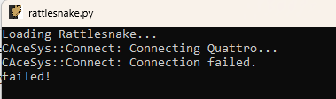

# Data Physics Quattro Devices

(sec:dp_quattro_hardware)=
# Data Physics Quattro Devices

Rattlesnake is able to run Data Physics Quattro devices through the programming interface exposed by `DPQuattro.dll`, which is provided with installation materials for the Quattro device.  Users must have the proper drivers installed in order to communicate with the Quattro device.  Issues with device installation and licensing are outside the scope of the document; users are encouraged to contact Data Physics support for issues communicating with the hardware.  If users can run the examples provided by Data Physics for the Quattro device, it should also work with Rattlesnake, as the same library calls are used.

### Setting up the Channel Table for Quattro Devices <!--Section 6.1-->

This section lists the channel table requirements specific to the Data Physics Quattro device.
    
The Quattro is a single standalone device, and therefore needs not be referenced by a specific name.  However, Rattlesnake requires an entry in the `Physical Device` column for each channel to show that the channel is active.  It is recommended to put `Quattro` in that space to make it clear that the connected device is a Quattro device.  The `Physical Channel` column should contain the channel number from the device that the row in the channel table represents.  For a Quattro device, this should range from 1--4.  Channels in Rattlesnake do not need to be in the same order as channels on the data acquisition system for Quattro devices.
    
The `Minimum Value (V)` column is not used.  The `Maximum Value (V)` column specifies both the minimum and maximum frequency.  Valid Ranges for the Quattro device are 0.1, 1.0, 10.0, and 20.0 V for acquisition channels and 2.0 and 10.0 V for output channels.
    
The `Coupling` column is where the channel coupling is specified.  Valid coupling values are

**AC Differential** specified by the entry `AC`, `AC Differential`, or `AC Diff` (case insensitive)
**DC Differential** specified by the entry `DC`, `DC Differential`, or `DC Diff` (case insensitive)
**AC Single-Ended** specified by the entry `AC Single`, `AC Single Ended`, or `AC Single-Ended` (case insensitive)
**DC Single-Ended** specified by the entry `DC Single`, `DC Single Ended`, or `DC Single-Ended` (case insensitive)
**AC IEPE** specified by the entry `IEPE`, `ICP`, `AC ICP`, or `CCLD` (case insensitive)

The Quattro device handles all signal conditioning so there doesn't need to be anything entered in the `Current Excitation Source` or `Current Excitation Value` columns.  

Recall for output channels, users of Rattlesnake must tee the output signal back into an acquisition channel.  This means using Quattro's two outputs with Rattlesnake will leave only two acquisition channels remaining.  The `Feedback Device` column must be populated in the row corresponding to the acquisition channel that the output is teed into, again using `Quattro` for convention, but otherwise any entry will suffice.  The `Feedback Channel` will be the output channel on the Quattro that is used.  This should range from 1--2.  Outputs in Rattlesnake do not need to be in the same order as outputs on the data acquisition system for Quattro Devices.

### Hardware Parameters <!--Section 6.2-->

When the Quattro device is selected from the `Hardware Selector`, Rattlesnake will bring up a file dialog asking for a Data Physics API file.  Users should navigate to the file `DpQuattro.dll`, which should have been delivered with the Quattro API media.  This `dll` file contains the Quattro programming interface that Rattlesnake uses to communicate with the Quattro device.  If users cannot find this file, please contact Data Physics support, as Rattlesnake maintainers cannot provide this file.  Each file is licensed separately by Data Physics and cannot be shared.  The `dll` file should be alongside a `signal.001.qrt` file, which is the license file specific to each Quattro device.  If this license file is missing or is not the one paired to the Quattro hardware, the interface will not run.

The only other parameter specific to the Quattro device is the `Sample Rate`.  Quattro devices used with Rattlesnake have discrete sampling rates available.  These are 16, 20, 25, 32, 40, 50, 64, 80, 100, 128, 160, 200, 256, 320, 400, 512, 640, 800, 1024, 1280, 1600, 2048, 2560, 3200, 4096, 5120, 6400, 8192, 10240, 12800, 20480, 25600, 40960, 51200, 102400, or 204800 samples per second.  This is a subset of the full set of Quattro sample rates, because Rattlesnake only deals with integer numbers of samples per second.

### Implementation Details <!--Section 6.3-->

This section contains details on the Quattro implementation in Rattlesnake, which may be helpful for users when diagnosing issues that arise in the controller.

#### Drivers <!--Subection 6.3.1-->

The Data Physics Quattro device connects to the computer via USB, and must have drivers installed to correctly connect.  Drivers are found in the `\Driver` folder of the DpQuattro API package.  If you have trouble finding or installing the drivers, please contact Data Physics support, as the Rattlesnake authors cannot provide these files.

#### Programming API <!--Subsection 6.3.2-->

The Data Physics DpQuattro API is a 64-bit programming interface written in C/C++.  It is compiled to a Windows `dll`, so it can be used by any other environment that can use a Windows-based C library.  Therefore the Quattro device as implemented in Rattlesnake is only usable on 64-bit Windows operating systems, not Mac or Linux.  Additionally, if you are not using a 64-bit Python executable, you will not be able to connect to the 64-bit `dll`, and will not be able to use the Quattro device.
    
The API is accessed using the Python `ctypes` module, by calling its `WinDLL` method on the path to the `dll`.  The file `components/data_physics_interface.py` in the main Rattlesnake directory constructs an object-oriented Python interface from the functions in this `dll`.  The file `components/data_physics_hardware.py` then defines the acquisition and output hardware objects with the correct methods that Rattlesnake will call.

#### Debugging <!--Subsection 6.3.3-->
    
If issues with the Quattro devices are encountered, users can look at the Rattlesnake command prompt that appears when the software is loaded, or the command prompt from which Rattlesnake is run.  The DpQuattro API will print messages to this prompt periodically that can be useful in debugging issues.  These will generally be prefixed by `CAceSys` and provide some information on the issue encountered.  Figure \ref{fig:quattroissuecommandline} shows an example that occurred if the Quattro devices is not connected to the computer.  Other diagnostic messages are also printed, so a message appearing does not necessarily mean an error has occurred.
    

    
**Figure 6-1. An example issue where the Quattro fails to connect.**

For more debugging information, there is a `DEBUG` flag in the file `components/data_physics_interface.py` that is by default set to `False`.  If users change that to `DEBUG = True`, then the Quattro interface will output a log file with more information about its activities.
